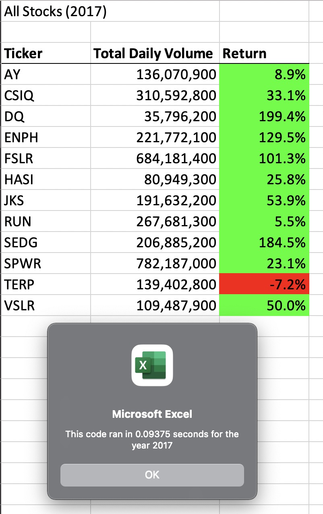
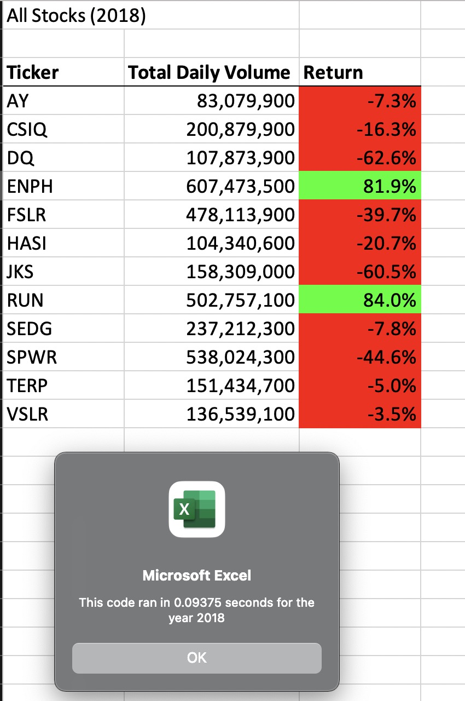

# stocks-analysis

Overview of project: Explain the purpose of this analysis

Steve’s parents are trying to invest in green energy, such as hydroelectricity, wind energy, geothermal energy, bioenergy and so on. They are about to invest all money into DAQO (DQ) New Energy Corp who makes silicon wafers for solar panels. Steve has been asked to analyze a handful of green energy stocks in addition to DAQO’s stock. 

Through refactoring the VBA code, different years have been analyzed. The results of 2017 and 2018 will be a suggestion for Steve’s parents to do the investment with DQ or with another green energy company.

Rsults of the Analysis

The results for 2017 got run in 0.09375 seconds. Most of stocks have positive returns. The top three daily volumes are SPWR, FSLR, and CSIQ. The bottom three daily volumes are DQ, HASI, and VSLR. The top three returns are DQ, SEDG, and ENPH. The bottom three returns are TERP, RUN, and AY. Among the bottom three returns, TERP has the negative return.

The results for 2018 got run in 0.09375 seconds. Most of stocks have negative returns. The top three daily volumes are ENPH, SPWR, and RUN. The bottom three daily volumes are AY, HASI, and DQ. The top two returns are RUN, ENPH, which are positive returns. The rest of the stocks have the negative returns.

 

